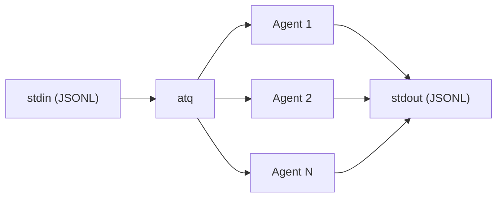

# atq

A task queue for agentic workloads.

## The problem

You have a large batch of tasks that need to be processed using an agent (language, reasoning, tool use tasks).

Running these through a single long-lived agent doesn't work:

- **Context bloat.** The agent accumulates results from previous tasks. Gets slower, more expensive, less focused.
- **Fragile batching.** One failure midway can stall everything. Tracking what succeeded is painful.
- **No concurrency.** Processing items one at a time when each task is independent is just slow.

## The approach

Each task gets its own fresh agent with a clean context. A pool of agents process items concurrently — one finishes, the next starts immediately.

- **Fresh context per task.** Each agent only sees the item it's working on. Better focus, lower cost, no cross-contamination.
- **Concurrent by default.** Control the pool size with `concurrency`.
- **Stream results.** Results stream to stdout as agents complete.



## CLI

```bash
cat companies.jsonl | atq -p "Normalize this company name. Return just the name." -c 10 -m claude-sonnet-4-6
```

Input is piped via stdin (one JSON object per line):
```jsonl
{"name": "Google LLC"}
{"name": "APPLE INC."}
{"name": "Meta Platforms, Inc."}
```

**Output** (stdout, one JSON line per completed item):
```jsonl
{"item":{"name":"Google LLC"},"output":"Google"}
{"item":{"name":"APPLE INC."},"output":"Apple"}
{"item":{"name":"Meta Platforms, Inc."},"output":"Meta"}
```

**Progress** (stderr):
```
[1/3]
[2/3]
[3/3]
```

### Flags

| Short | Long | Required | Default | Description |
|-------|------|----------|---------|-------------|
| `-p` | `--prompt` | yes | — | Instructions for the agent |
| `-c` | `--concurrency` | no | `10` | Max parallel agents |
| `-m` | `--model` | no | — | Model name |

## Library

```js
import { Task } from 'atq';

const task = new Task({
  prompt: 'Normalize this company name. Return just the name.',
  concurrency: 10,
  model: 'claude-sonnet-4-6',
  items: [{ name: 'Google LLC' }, { name: 'APPLE INC.' }],
});

for await (const { item, output, progress } of task.run()) {
  console.log(`[${progress.completed}/${progress.total}] ${item.name} → ${output}`);
}
```

### `new Task(options)`

| Option | Type | Default | Description |
|--------|------|---------|-------------|
| `prompt` | `string` | — | Instructions for the agent |
| `concurrency` | `number` | `10` | Max parallel agents |
| `items` | `array` | `[]` | Items to pre-load into the queue |
| `model` | `string` | — | Model name |

### `.add(item)`

Add an item to the queue.

### `.run()`

Async generator. Each yield: `{ item, output, progress: { completed, total } }`

## Install

```
npm install atq
```
